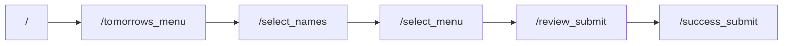
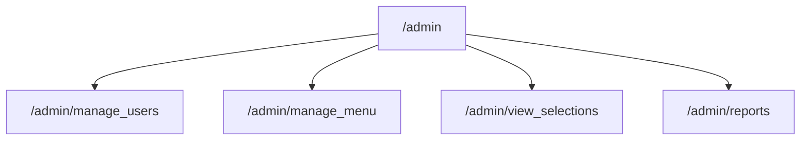

# Canteen Meal Opt-In — project overview

This document explains how the app is structured, what each main page does, and where important functions live. For the database schema and PostgreSQL DDL, see [database-schema-and-postgres-migration.md](./database-schema-and-postgres-migration.md).

---

## What the app does

Staff opt in or out of **meals on an upcoming canteen menu** before a **deadline**. Admins maintain **departments**, **users**, **menus**, **meals**, and review **selections** and **reports**.

---

## Tech stack

| Layer | Choice |
|--------|--------|
| Framework | Next.js 16 (App Router), React 19 |
| Styling | Tailwind CSS 4 |
| Icons | Lucide React |
| Database | PostgreSQL via `pg` (server-only) |
| Client → server | `fetch()` to `/api/*` route handlers |
| PDF / Excel | jsPDF, jspdf-autotable, xlsx |

---

## How data access works

1. **Browser (client components)** call functions in `src/utils/*`.
2. Those functions use **`apiFetch`** (`src/utils/api-client.ts`) to call **REST-style** routes under `src/app/api/**`.
3. Route handlers import **`src/lib/db/repos.ts`**, which runs **parameterized SQL** through **`src/lib/db/pool.ts`** (`DATABASE_URL`).

There is **no** direct database access from the browser. API routes are not authenticated in this repo; treat that as a gap if you expose the app publicly.

---

## Environment variables

| Variable | Used by | Purpose |
|----------|---------|---------|
| `DATABASE_URL` | `src/lib/db/pool.ts` | PostgreSQL connection string (server-side only) |

See `.env.example` in the project root.

---

## Route groups (URLs)

Next.js **route groups** in parentheses do **not** appear in the URL:

| Folder | URL effect |
|--------|------------|
| `src/app/(home)/page.tsx` | `/` |
| `src/app/(user)/…` | Paths like `/select_names`, `/tomorrows_menu` (no `(user)` in URL) |
| `src/app/admin/…` | `/admin`, `/admin/manage_menu`, etc. |

---

## Pages (each screen)

Below, **utils** means functions from `src/utils/*` that hit the API. **Local** means helpers defined inside the page component (not exported).

### Public / staff flow

| URL | File | Purpose |
|-----|------|---------|
| `/` | `src/app/(home)/page.tsx` | Landing: branding, short instructions, link to **Continue** → `/tomorrows_menu`. Server component; no data fetch. |
| `/tomorrows_menu` | `src/app/(user)/tomorrows_menu/page.tsx` | Shows **tomorrow’s active menu** (meals, deadline, optional “today’s special”). Uses **`getTomorrowsMenu()`**. **Local:** `formatDate`, `formatDeadline`. Link into opt-in flow. |
| `/select_names` | `src/app/(user)/select_names/page.tsx` | **Step 1:** Pick one or more users from the directory. **`getAllUsers`**, **`getAllDepartments`**. Builds a department id → name map. **Local:** `getDepartmentName`, filter by search. Persists **`selectedUsers`** in `localStorage`. |
| `/select_names/select_menu` | `src/app/(user)/select_names/select_menu/page.tsx` | **Step 2:** For each selected user, set opt-in/out per meal. **`getTomorrowsMenu`**, **`getMealsByMenuId`**, **`getSelectionsByUserId`**, **`getAllDepartments`**. **Local:** expand/collapse user cards, sync selection state, persist **`userMealSelections`** to `localStorage`. |
| `/select_names/select_menu/review_submit` | `src/app/(user)/select_names/select_menu/review_submit/page.tsx` | **Step 3:** Review then **`handleSubmit`**: loops users/meals and calls **`createSelection`** for each opted-in choice; clears storage; navigates to success. **Local:** `getDepartmentName`, `getMealName`, `getYesCount`, expand toggles. |
| `/success_submit` | `src/app/(user)/success_submit/page.tsx` | Static success message; links back to `/select_names` or `/`. |

### Admin

| URL | File | Purpose |
|-----|------|---------|
| `/admin` | `src/app/admin/page.tsx` | Dashboard: **`getDashboardStats`**, **`getActiveMenu`**. Stat cards link to manage users, menu, selections, reports. Shows active menu summary. |
| `/admin/manage_menu` | `src/app/admin/manage_menu/page.tsx` | CRUD **menus** and **meals**, filter by search/status, set **today’s special** (`setTodaysSpecial`). Uses **`getAllMenus`**, **`getAllMeals`**, **`createMenu`**, **`updateMenu`**, **`deleteMenu`**, **`createMeal`**, **`updateMeal`**, **`deleteMeal`**, **`getMealsByMenuId`**, **`getStatusColor`**. **Local:** `getMealsForMenu`, handlers for modals, collapse state. |
| `/admin/manage_users` | `src/app/admin/manage_users/page.tsx` | CRUD **users** and **departments**, CSV **bulk import**. **`getAllUsers`**, **`createUser`**, **`updateUser`**, **`deleteUser`**, **`searchUsers`**, **`getAllDepartments`**, department CRUD, **`downloadCSVTemplate`**. Modals: add/edit user, department, bulk import. **Local:** `getDepartmentName`, `handleSearch`, filters. |
| `/admin/view_selections` | `src/app/admin/view_selections/page.tsx` | Table of all **selections** with filters; resolves user, department, meal, menu via joined data. **`getAllSelections`**, **`getAllDepartments`**, **`getAllMenus`**, **`getAllMeals`**, **`getAllUsers`**. **Local:** `getUserName`, `getUserDepartment`, `getDepartmentName`, `getMenuName`, `getMealName`, `getMealDate`, export helpers as implemented in file. |
| `/admin/reports` | `src/app/admin/reports/page.tsx` | Pick a **menu**, load **`getSelectionsByMenuId`** (denormalized rows), **`getMealsByMenuId`**, build per-meal breakdown. **Local:** print (`handlePrint`), PDF (**jsPDF** / **autoTable**), Excel (**xlsx**), stats (submitted count, opt-in count). Uses **`getStatusColor`** for UI. |

---

## Layout and global UI

| File | Role |
|------|------|
| `src/app/layout.tsx` | Root HTML, fonts (Geist), global CSS, **`Toaster`** for in-app toasts. |
| `src/app/(home)/layout.tsx` | Pass-through wrapper for the home segment. |
| `src/components/Navbar.tsx` | Pill-style nav: title, step label, optional **back** link. |
| `src/components/alert.tsx` | Toast system: **`toast.success`**, **`toast.error`**, **`Toaster`** provider. |

---

## Components (modals & forms)

These are mostly **presentational + form state**; they invoke callbacks passed from pages (which call utils).

| Component | Typical use |
|-----------|-------------|
| `AddUserModal` / `EditUserModal` | User name + department (name from dropdown). |
| `AddDepartmentModal` | Create/delete departments list. |
| `BulkImportModal` | CSV upload; **`parseCSV`**, **`validateUsers`**, **`bulkCreateUsers`**. |
| `AddMenuModal` / `EditMenuModal` | Menu name, date, deadline, status. |
| `AddMealModal` / `AddMealToMenuModal` / `EditMealModal` | Meal name, description, menu association. |

---

## Client utilities (`src/utils`)

All network-backed functions below ultimately call **`/api/...`** (see next section).

### `api-client.ts`

| Function | Purpose |
|----------|---------|
| **`apiFetch<T>(path, init?)`** | `fetch` with JSON body/parse; throws with server `error` message on non-OK responses. |

### `users.ts`

| Function | Purpose |
|----------|---------|
| **`getAllUsers`** | List users (newest first). |
| **`createUser`** | Insert user (`name`, `department` = department **UUID**). |
| **`updateUser`** | Patch user by id. |
| **`deleteUser`** | Delete user by id. |
| **`getUserById`** | Single user or `null` if missing. |
| **`getUsersByDepartment`** | Filter by department id. |
| **`searchUsers`** | `ILIKE` search on name. |

### `departments.ts`

| Function | Purpose |
|----------|---------|
| **`getAllDepartments`** | All departments, sorted by name. |
| **`createDepartment`** / **`updateDepartment`** / **`deleteDepartment`** | CRUD. |
| **`getDepartmentById`** | One department or `null`. |
| **`searchDepartments`** | `ILIKE` on name. |
| **`checkDepartmentExists`** | Case-insensitive name clash check (optional exclude id). |

### `menu.ts`

| Function | Purpose |
|----------|---------|
| **`getAllMenus`** | All menus by date desc. |
| **`createMenu`** / **`updateMenu`** / **`deleteMenu`** | CRUD. |
| **`getMenuById`** | One menu or `null`. |
| **`searchMenus`** / **`getMenusByStatus`** / **`getMenusByDateRange`** | Filtered lists. |
| **`getActiveMenu`** | Server: active menus from **today**, nested **meals**, auto-**complete** past deadlines. |
| **`getTomorrowsMenu`** | Server: active menus, prefer tomorrow’s date else earliest. |
| **`setTodaysSpecial`** | Set `menu.todays_special` to a meal id. |
| **`getStatusColor`** | Tailwind class helper for status chips (pure UI). |

### `meals.ts`

| Function | Purpose |
|----------|---------|
| **`getAllMeals`** | All meals. |
| **`createMeal`** / **`updateMeal`** / **`deleteMeal`** | CRUD. |
| **`getMealById`** | One meal or `null`. |
| **`searchMeals`** | Search by meal name; order uses **menu date** on server. |
| **`getMealsByMenuId`** | Meals for one menu. |
| **`getMealsByDate`** | Legacy placeholder: returns all meals (see code comment in app). |

### `selections.ts`

| Function | Purpose |
|----------|---------|
| **`getAllSelections`** | All selection rows. |
| **`createSelection`** | Insert `user_id`, `meal_id`, `opted_in`. |
| **`updateSelection`** / **`deleteSelection`** | Patch / delete by selection id. |
| **`getSelectionsByUserId`** / **`getSelectionsByMealId`** | Filtered lists. |
| **`getSelectionsByMenuId`** | Rows for a menu with **user name**, **department name**, **meal name** (joined on server). |
| **`SelectionWithDetails`** | Type for report rows. |

### `bulkImport.ts`

| Function | Purpose |
|----------|---------|
| **`parseCSV`** | Parse `Name`, `Department` columns (quoted CSV aware). |
| **`validateUsers`** | Match department names against known departments. |
| **`bulkCreateUsers`** | POST bulk rows to API (`name` + department **id** per row). |
| **`generateCSVTemplate`** / **`downloadCSVTemplate`** | Template file for admins. |
| **`readFileAsText`** | FileReader helper for upload. |

### `dashbaord.ts` *(filename spelling as in repo)*

| Function | Purpose |
|----------|---------|
| **`getDashboardStats`** | Single API call; maps JSON to **`DashboardStat[]`** (icons + links for admin home). |

---

## API routes (`src/app/api`)

| Method & path | Role |
|---------------|------|
| **GET/POST** `/api/departments` | List or create; **GET ?q=** searches. |
| **GET/PATCH/DELETE** `/api/departments/[id]` | One department. |
| **GET** `/api/departments/check?name=&excludeId=` | Existence check. |
| **GET/POST** `/api/users` | List/create; **GET ?search=**, **?department=**. |
| **GET/PATCH/DELETE** `/api/users/[id]` | One user. |
| **POST** `/api/users/bulk` | Body `{ rows: [{ name, departmentId, rowNumber }] }` → partial errors. |
| **GET/POST** `/api/menu` | List/create; **GET ?search=&status=&startDate=&endDate=**. |
| **GET/PATCH/DELETE** `/api/menu/[id]` | One menu; PATCH may include **`todays_special`**. |
| **GET** `/api/menu/active` | Active menu + meals + expiry update. |
| **GET** `/api/menu/tomorrow` | Tomorrow-oriented active menu + meals + expiry update. |
| **GET/POST** `/api/meals` | List/create; **GET ?menuId=&search=**. |
| **GET/PATCH/DELETE** `/api/meals/[id]` | One meal. |
| **GET/POST** `/api/selections` | List/create; **GET ?userId=&mealId=**. |
| **PATCH/DELETE** `/api/selections/[id]` | Update/delete one selection. |
| **GET** `/api/selections/by-menu/[menuId]` | Joined report rows for that menu. |
| **GET** `/api/dashboard/stats` | Aggregated counts for dashboard cards. |

---

## Database layer (`src/lib/db`)

| File | Role |
|------|------|
| **`pool.ts`** | `server-only` **`pg.Pool`** from `DATABASE_URL`. |
| **`repos.ts`** | All SQL: departments, users, menus, meals, selections, dashboard counts, bulk user insert, menu/meal aggregation for active/tomorrow, joined selections for reports. Expects **`docs/migrations/000-initial-schema.sql`**: bigint ids, **`menu.status`** as **text** with CHECK. |

Notable repo behaviours:

- **`getActiveMenuWithExpiryUpdate`** / **`getTomorrowsMenuWithExpiryUpdate`**: load active menus with **`json_agg`** of meals; mark **`completed`** when **`deadline`** passed.
- **`listSelectionsByMenuIdJoined`**: joins **users → departments** so **department** is a **name**, not a raw id.
- Dashboard **`participationRate`**: uses **distinct** `user_id` on selections vs total users.

---

## Types (`src/types`)

| Module | Main types |
|--------|------------|
| **`user.ts`** | `User` (`department` is **`departments.id`**, stringified bigint in API JSON). |
| **`department.ts`** | `Department`. |
| **`menu.ts`** | `Menu`, `MenuMeal`, `MenuFormData`, `MenuStatus`. |
| **`meal.ts`** | `Meal`, `MealFormData`, plus UI helper types. |
| **`selection.ts`** | `Selection`, form types, `UserMealSelections` for multi-user UI. |
| **`report.ts`** | `DashboardStat`, report/analytics shapes (some used for typing exports/print). |
| **`activity.ts`** / **`layout.ts`** | Small shared types. |
| **`index.ts`** | Re-exports above. |

---

## End-to-end flow (staff)

Data persistence:

- **Draft UI state:** `localStorage` (`selectedUsers`, `userMealSelections`).
- **Submitted choices:** `selections` table via **`createSelection`**.

---

## End-to-end flow (admin)

---

## Related documentation

- [database-schema-and-postgres-migration.md](./database-schema-and-postgres-migration.md) — tables, columns, PostgreSQL DDL, migration notes.

---

*Generated to match the repository layout; if you add pages or APIs, update this file alongside those changes.*
